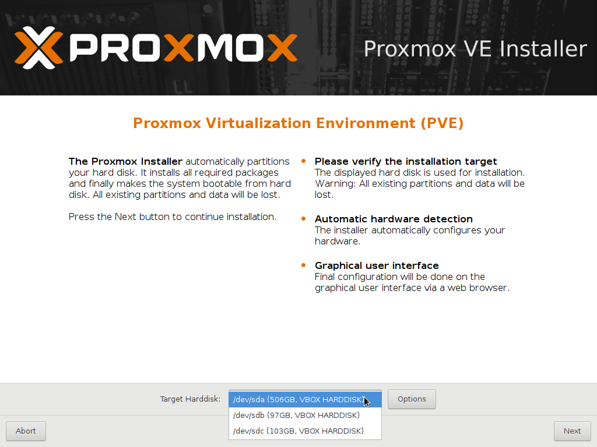
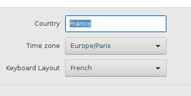
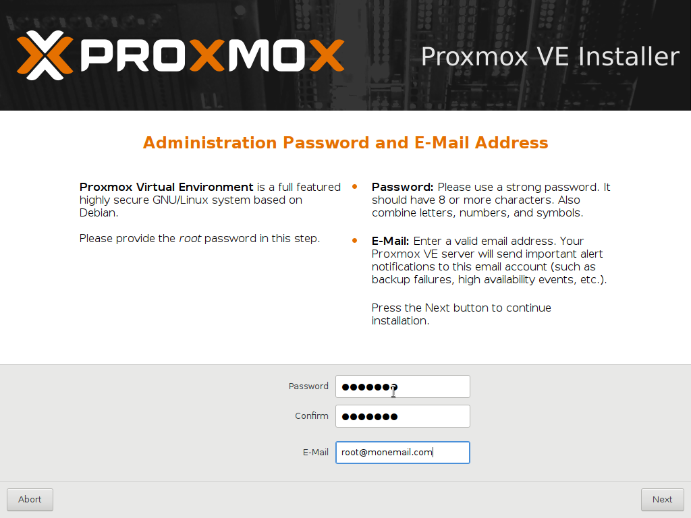

####début de brouillon, aucune mise en page fait######

Proxmox est un système de virtualisation basé sur Debian et qui utilise KVM. Il permet à la façon de virtualbox de créer des  snapshots de machine, des sauvegardes complètes et beaucoup d'autres fonctionnalités. 
Le serveur et les vms peuvent se gérer à partir d'une interface web, et une gestion possible des comptes utilisateurs va permettre de laisser à des tiers un accès avec plus ou moins de droits sur une machine (comme le serveur bcdi par exemple).  

Dans l'installation présentée, il y a trois disques dur:

sda 500 Go, sdb 100 Go et sdc 500 Go



On choisit d'installer proxmox sur l premier disque sda.  
Pour un serveur comme le se3, il sera clairement conseillé de mettre plusieurs disques identiques et d'utiliser un système zfs avec du cache. Les machines virtuelles pourront elles être en autres formats (xfs,ext4,ntfs...)

On choisit la langue, ainsi que la ville et le type de clavier.


Choix du mdp root

**choix du réseau**
entrer l'ip du serveur, pour le dns, on pourra choisir l'ip du Amon, ouun dns externe comme celui de google.
L'installation des paquets est automatique.
Le serveur redémarre , et indique comment acceder à l'interface de gestion. On peut acceder evidemment au serveur en ssh (connexion directe par le compte root possible).


Il faudra se connecter en root sur le serveur et configurer le proxy en ligne de commande

```
export http_proxy="http://172.20.0.1:3128"
export https_proxy="http://172.20.0.1:3128"
export ftp_proxy="http://172.20.0.1:3128"
```

Il suffit d'utiliser un navigateur et de se rendre à l'adresse indiquée. 
**ATTENTION**, il faudra peut-être désactiver le proxy du navigateur pour accéder à l'interface.
on indique le mode pam authentification, puis le login "root", et mdp.
Un message d'erreur indique que le serveur n'est pas enregistré, ce qui est normal. Ignorer donc cet avertissement.


On arrive sur l'interface
la partie 'datecenteur' peut contenir plusieurs noeuds (serveurs proxmox). ici il n'y en a qu'un (nom netbios pve).
De base, le systeme est installé sur la partie "local (pve)", les vms et snapshots seront écrites sur cet espace dans /var/lib/vz  si on ne modifie rien. 
Le reste du disque est organisé en lvm et pourra contenir les sauvegardes et images iso de livecd.


Il suffit de double cliquer sur l'espace de stockage pour changer le type de données qu'on va y mettre.

Il est possible de récupérer les mises à jour de proxmox sans payer de cotisation en utilisant le dépot non-entreprise.
https://pve.proxmox.com/wiki/Package_Repositories

ON va monter les deux disques sur le serveur pour y mettre les vm et les sauvegardes
photo 10

On peut faire datacenter>stockage>ajouter> répertoire
photo 11
On choisi également le type de contenu que l'on souhaite y mettre:
image iso --> livecd
conteneur et images disques --> vm et snapshots
fichier sauvegarde vzdump --> export de machine pour sauvegarde complète.
photo 12


Ajout de livecd iso pour booter sur clonezilla une vm (ou autre livecd)
On va sur le serveur (et non plus sur datacenter), on se place sur l'espace choisi pour mettre les iso ex (local-sav), puis résumé>upload, on ajoute le fichier iso.


